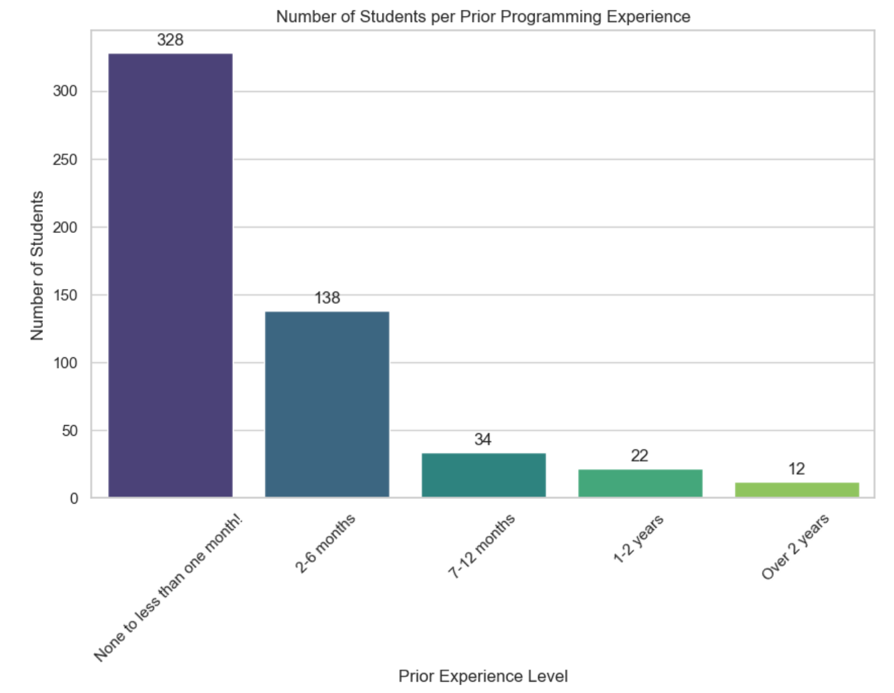
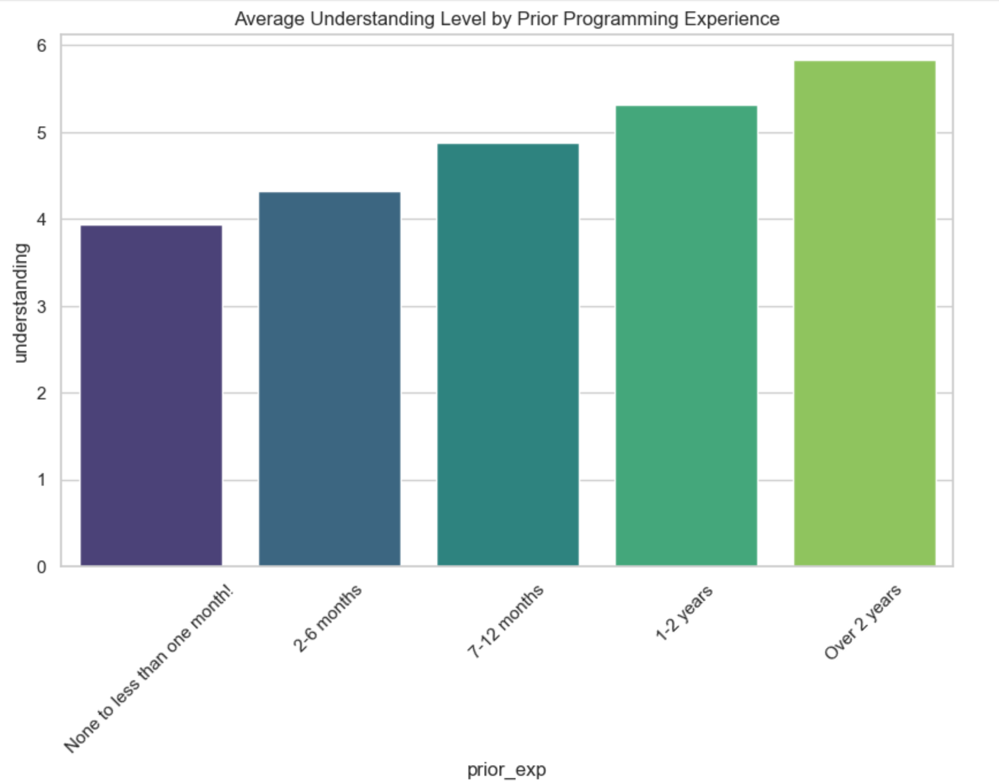
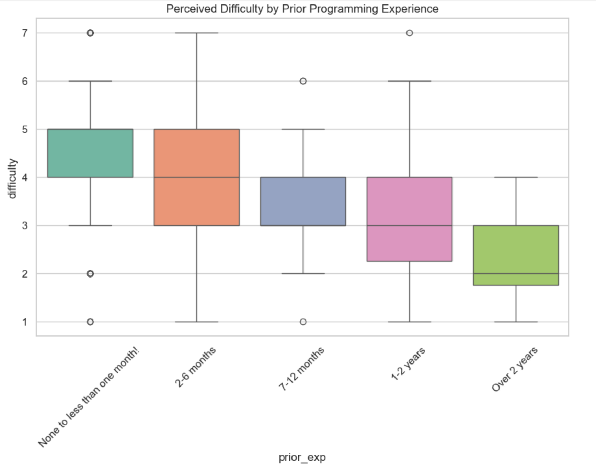

---
# Do not edit the text between these lines!
layout: default
---

# Navigating the On-Ramp: Analyzing Prior Experience in COMP110

## Project Overview: Continuous Improvement
In this project, I explored how prior programming experience impacts a student's journey through COMP110. Using a dataset of survey responses from current students, I sought to identify if beginners (those with less than one month of experience) face disproportionate hurdles in understanding and difficulty. 

The goal of this analysis is **Continuous Improvement**: by identifying where the learning curve to computer science is steepest, the TA's and instructors can better ensure all students can succeed.

---

## Data Analysis Summary
Using Python utility functions, I processed survey data to compare three key variables:
1. **Prior Experience**: The amount of programming a student did before the course.
2. **Difficulty**: A Likert scale (1-7) of how hard the student finds the course.
3. **Understanding**: A Likert scale (1-7) of how well the student feels they understand the material.

By converting these survey responses into numerical data, I calculated averages and visualized the spread of student opinion across the entire class.

---

## Visualizing the Experience Gap

### 1. The Class Profile
This chart shows the distribution of experience levels across the current semester. It highlights that a significant portion of the class enters with little to no prior exposure to coding.

### 2. Average Understanding by Experience
As hypothesized, there is a connection between prior experience and current understanding. Students with over a year of experience report the highest confidence, while true beginners are still finding their bearings.

### 3. Difficulty Distribution
This boxplot reveals the difficulty range. While some beginners find the course manageable, the median difficulty for those with no experience is notably higher than for those with a coding background.

---

## Final Conclusions and Recommendations

My analysis confirms that while COMP110 is designed as an introductory course, the experience gap significantly impacts perceived difficulty and student confidence. 

### Key Findings:
* **Beginners** report a median difficulty score of 5/7, compared to 3/7 for experienced students.
* **Understanding** scores remain relatively high across all groups, suggesting that while the course is hard, the teaching methods are effective.

### Recommendations for Improvement:
To create more value for the "Beginner" group, I recommend implementing **"Syntax-First" workshops** in the first three weeks of the semester. This would help bridge the gap for students who have never seen a `for` loop or a `variable` before, allowing them to focus on logic rather than just notation.

**Potential Trade-offs:** Redirecting TA resources to beginner-only sessions could decrease the availability for advanced students, but it ensures a more level learning environment for the majority of the enrollment.

---
